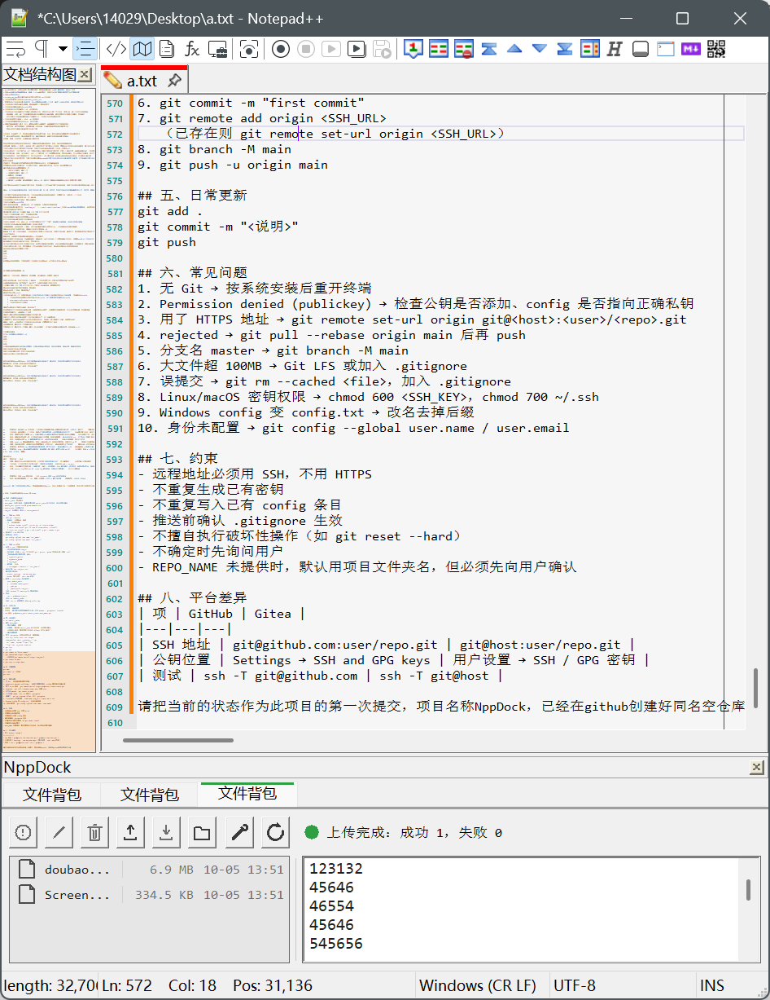

# NppDock

给 Notepad++ 造了一个**底部停靠面板**，面板里可以**嵌自己写的 Win32 小工具**；
而且加一个新工具**不需要改容器一行代码**。

仓库里除了容器本身，还带着三个已经跑通的应用当样板：

| 产物 | 是什么 | 界面要点 |
|---|---|---|
| `NppDock.dll` | **容器**：只占 Notepad++ 的一个底部面板槽位，提供标签条 + 内容区 | 标签条常驻，是"添加应用"的唯一入口 |
| `NppDockApp_MD5.exe` | 应用「**文件校验**」：MD5 / SHA-1 / SHA-256 / SHA-384 / SHA-512 / CRC32（全自实现） | 三行 + 状态行，窄面板自动压缩 |
| `NppDockApp_NET.exe` | 应用「**网络测试**」：Ping / 路由追踪 / 端口扫描 / DNS 查询 | 一整行，参数全在 JSON 配置里 |
| `NppDockApp_PACK.exe` | 应用「**文件背包**」：服务器上的便笺自动同步 + 小文件中转站 | 左右分栏，便笺 / 文件栏两条独立刷新线 |

三个 exe 都可以**单独双击运行**（普通顶层窗口），也可以被 dock 拉进面板里（无边框、铺满内容区）——
同一份代码两种形态。

---

## 演示样例

整个 Notepad++ + 底部面板（面板里开着三个应用：文件校验 / 网络测试 / 文件背包）：



---

## 30 秒跑起来

前置：**Windows** + Visual Studio 2022 Build Tools（含"使用 C++ 的桌面开发"）+ Windows SDK + Python 3.8+。
不需要 CMake、不需要 vcpkg，也不用装 Notepad++ 就能跑测试。

```bat
cd plugins\NppDock

python build.py                :: 编译容器 + 三个应用 + 测试
python build.py --check-deps   :: 额外做静态自检（确认没有依赖 VC 运行库）
python build.py --install      :: 构建并部署到便携版 Notepad++

cd build\tests
test_integration.exe           :: 离线集成测试：34 条断言，**不需要 Notepad++**
```

⚠️ `test_integration.exe` 内部用相对路径找 `NppDock.dll`，**必须 `cd build\tests` 再跑**，
否则报错误码 126（找不到模块），很容易被误判成"构建坏了"。

产物在 `build/NppDock/` 下；`--install` 会把它们拷到 `Notepad++/plugins/NppDock/`。
**`NppDockApp_*.exe` 必须和 `NppDock.dll` 同目录** —— 容器就是靠扫描自己所在目录来发现应用的。

---

## 先读这几份（按这个顺序）

| # | 文档 | 什么时候读 |
|---|---|---|
| 1 | **本文件** | 先搞清楚有什么、放哪、怎么跑 |
| 2 | [`docs/铁律与踩坑要点.md`](docs/铁律与踩坑要点.md) | **动手改代码之前**扫一遍对应主题。这里的坑大多**不报错**，只是"看起来不对"，事后极难反查 |
| 3 | [`docs/NppDock应用开发指南.md`](docs/NppDock应用开发指南.md) | 要**写一个能嵌进 dock 的应用**时读这份：对接契约 + 必须做到的若干条 + 骨架代码 + 怎么验证 |
| 4 | [`plugins/NppDock/README.md`](plugins/NppDock/README.md) | 要知道容器/三个应用的**具体行为规格**、目录结构、测试怎么跑 |

> 这三份文档是给"**完全没有上下文的人或 AI**"写的：只讲现状与规矩，不写"当年怎么改的"。
> 早期那些逐轮迭代的过程文档**已从仓库移除**（初始提交就是精简后的状态），不随仓库分发。

---

## 目录地图

```
pluginsWorkspace/                    ← 仓库根（这个目录本身就可以克隆到任意位置）
├─ README.md                         ← 本文件
├─ docs/                             ← 跨插件的文档
│  ├─ NppDock应用开发指南.md          ← ★ 写应用前先读
│  ├─ 铁律与踩坑要点.md               ← ★ 动手前先扫
│  └─ images/                        ← README 那张截图
├─ sdk/                              ← Notepad++ 官方 SDK 头（原样拷贝，不改）
└─ plugins/NppDock/                  ← 容器 + 三个应用（一个插件的全部东西都在这）
   ├─ build.py                       ← 构建 + 部署 + 静态自检
   ├─ src/
   │  ├─ NppDockApi.h                ← 跨 DLL 的纯 C ABI 契约（宿主 API + 模块接口）
   │  ├─ main/                       ← 容器：入口 / 面板注册 / 状态持久化 / 应用页管理
   │  ├─ framework/NppDockUtil.h     ← 路径 / 文件 / 字符串 / 日志等无状态工具
   │  ├─ common/                     ← 自研 mini JSON（jsonlite）+ 共享自绘（appui）
   │  ├─ apps/{md5tool,nettest,backpack}/  ← 三个可嵌入应用，各自独立编译
   │  └─ tests/                      ← 离线集成测试 + 测试用哑模块
   ├─ tools/
   │  ├─ dock_app_probe.py           ← 真机探针（发真实鼠标事件驱动整条链路）
   │  ├─ unit/run.py                 ← 单元测试壳（跑法见下）
   │  ├─ shoot_readme.py             ← 重新生成 README 那张截图
   │  └─ check_*.py / gen_*.py       ← 摘要自检、工具栏、图标生成
   ├─ scripts/run.py                 ← 跑产物并回显输出
   ├─ build/                         ← 编译产物（可整个删掉重建，**不入库**）
   └─ _t/                            ← 测试样本与截图（可随时删，**不入库**）
```

---

## 不可破的规矩（速览）

这几条是**违反之后最难查**的，完整清单在 [`docs/铁律与踩坑要点.md`](docs/铁律与踩坑要点.md)：

1. **绝不跨进程 `SendMessage` 传指针。** 宿主与嵌入应用是两个进程，指针不会被封送 ——
   这么干会把 Notepad++ 直接写崩（有过血债）。要驱动对面就用消息 + 真实鼠标事件。
2. **重绘只作废，不同步等。** 一律 `RDW_INVALIDATE`，**永远不要** `RDW_UPDATENOW` ——
   跨进程同步重画会让整个 Notepad++ 死锁。
3. **所有进程都是 `/MT`（静态链接 CRT）。** 目标机上缺 VC 运行库时插件会**静默不加载**；
   跨 DLL 也因此**不许 `delete` 对方 new 出来的对象**（各有独立堆）。
4. **嵌入的应用必须自研。** 第三方 exe 改不动它的 DPI 感知与窄宽度布局，硬嵌必然"很怪异"。
5. **要能干净地结束。** 收到 `WM_CLOSE` 就退，别留孤儿进程；宿主被强杀时靠 Job Object 兜底。
6. **定位目录用"向上找特征文件"，不要数 `..` 层数。** 层数写错不报错，只会"找不到文件"，
   看起来像磁盘/权限问题。
7. **文本/资源的坑**：变量名别用 `small` / `near` / `far`（Windows 头里有 `#define`）；
   配置文件里的示例值会被当成真值用，必须可识别并在读取时判掉。
8. **验证脚本化。** 这一层 bug 的特征就是"不报错，只是看起来不对" —— 靠肉眼看是查不出来的。

---

## 怎么写一个"同风格"的应用

标准动作就四步（细节与理由见 [`docs/NppDock应用开发指南.md`](docs/NppDock应用开发指南.md)）：

1. 抄一个现成的当模板：`src/apps/md5tool/`（最简单）、`nettest/`（引擎与界面分层）、
   `backpack/`（要跟网络/文件打交道）。
2. 实现"双形态"：**无参数 = 普通顶层窗口；带 `--dock-parent <HWND>` = 把自己 `SetParent` 进去**
   （改样式 → `SetParent` → `SetWindowPos`，顺序不能反）。
3. 加一个 `.rc` 版本资源，把 **`FileDescription`** 写成中文标题 —— 它会**直接变成标签页标题**。
4. 在 `build.py` 的 `APPS` 列表里登记一行，产物名必须是 `NppDockApp_XXX.exe`。
   然后 `python build.py --install`。**不需要改容器任何一行代码。**

界面上的三件事必须同时满足（否则嵌进去就难看）：按**父窗口客户区**动态算布局（不写死坐标）、
支持**窄宽度**（面板可能只有 300 多 px 宽）、字体按**当前 DPI** 取一份
（`SystemParametersInfoForDpi(..., dpi)`，**不要再乘一次 `dpi/96`** —— 那会正好放大 1.5 倍，而且不报错）。

---

## 怎么验证（三层）

| 层 | 跑什么 | 覆盖什么 |
|---|---|---|
| 离线集成测试 | `cd build/tests && test_integration.exe` | 用"假宿主"加载真实 DLL：导出函数、面板注册、状态持久化、应用发现（34 条断言，不需要 Notepad++） |
| 单元测试壳 | `python tools/unit/run.py` | 那些**从界面驱动不了**的纯逻辑：`ls -l` 解析、原子写、一次 ssh 的帧分割、输出上限 |
| 真机探针 | `python tools/dock_app_probe.py <命令>` | 发**真实鼠标/键盘事件**把整条链路跑一遍（模态菜单只能真点） |

单测壳的做法值得说一句：它把被测的 `.cpp` **整份 include 进来**，于是那些 `static` 函数
在同一个编译单元里直接可见，可以喂合成样本 —— 这条路子当场抓出过三个真 bug。

探针常用命令：

```bat
python tools\dock_app_probe.py addapp --text 文件背包   :: 右击标签条空白处，把应用嵌进来
python tools\dock_app_probe.py hashall --file _t\fox.bin :: 文件校验页总验收
python tools\dock_app_probe.py nettest                   :: 网络测试页总验收
python tools\dock_app_probe.py packv17                   :: 文件背包详细验收
python tools\dock_app_probe.py cfgapply                  :: 改配置点刷新即生效
python tools\dock_app_probe.py tabv14                    :: 标签条：最低宽度 / 菜单文字 / 双击关闭
```

⚠️ 探针是**附着到正在运行的 Notepad++** 上驱动的 —— 先开好 Notepad++ 再跑。
`_t/` 是探针的**临时样本目录**（不入库，克隆后不存在）：跑 `hashall` 前自己造一个样本，
比如 `mkdir _t && fsutil file createnew _t\fox.bin 4096`（或随便拷个文件进去）即可。
`dragsplitter` / `toggletest` 靠抓屏比对，需要 PIL。

---

## 环境要求

* **Windows 10/11**（代码用了 Win10 1607+ 的 API，但都是**动态取函数指针**，老系统上会自动退回）
* **Visual Studio 2022 Build Tools** + Windows SDK（`build.py` 用 vswhere 自己找，不用手动配环境变量）
* **Python 3.8+**（只用来跑构建脚本与工具链，不是运行时依赖）
* 便携版 Notepad++ 8.x（`--install` 的部署目标，路径写在 `build.py` 里）
